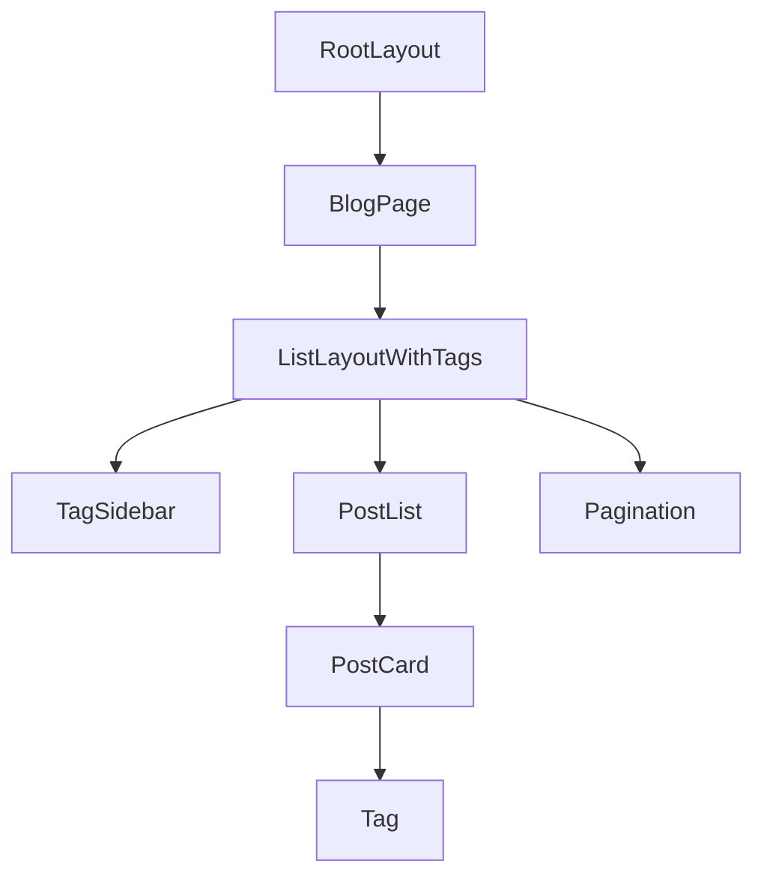

# MINYVINLY- Blog Site Documentation 

## Project Structure

### Core Directories
-   `/app` - Next.js App Router structure with various routes:
    - `/about` - About page
    - `/admin` - Admin interface and content management
    - `/blog` - Blog posts and listings
    - `/projects` - Projects section
    - `/tags` - Tag-based navigation
    - `/api` - API routes for backend functionality

### Additional Directories
-   `/data` - Content and configuration:
    - `/blog` - MDX blog posts
    - `/authors` - Author information
    - `siteMetadata.js` - Site configuration
-   `/public` - Static assets:
    - `/static/images` - Images and media
-   `/components` - Reusable React components
-   `/layouts` - Page layout templates

## Setting up the Project 

### First Time Configuration
```bash
# Install dependencies
yarn install 

# Create environment file
cp .env.example .env.local

# Configure .env.local with your settings:
NEXT_PUBLIC_ADMIN_PASSWORD='your-password'
NEXT_PUBLIC_GISCUS_REPO=''
NEXT_PUBLIC_GISCUS_REPOSITORY_ID=''
```

### Running the Application 
```bash
# Start development server
yarn dev 

# Build for production 
yarn build

# If using Windows PowerShell, set PWD first:
$env:PWD = $(Get-Location).Path
yarn dev
```

## Content Management

### Adding Blog Posts

1. **Create MDX File**
   - Location: `data/blog/your-post-title.mdx`
   - Use URL-friendly filenames (lowercase, hyphens)

2. **Post Template**:
```mdx
---
title: 'Your Post Title'
date: 'YYYY-MM-DD'
tags: ['Tag1', 'Tag2', 'Tag3']
draft: false
summary: 'A brief summary of your blog post'
---

Your blog post content here in markdown format.

### First Section

Your first section content...

### Second Section

Your second section content...
```

### Required Frontmatter Fields

| Field    | Description                    | Type                |
|----------|--------------------------------|---------------------|
| title    | Post title (in quotes)         | String             |
| date     | Publication date (YYYY-MM-DD)  | Date String        |
| tags     | Array of relevant tags         | String Array       |
| draft    | Publication status             | Boolean            |
| summary  | Brief post description         | String             |

### Image Management

1. **Image Storage**:
   - Place images in: `public/static/images/blog/`
   - Recommended formats: .jpg, .png, .webp

2. **Image Reference in MDX**:
```markdown

```

## Site Customization

### Basic Configuration (`data/siteMetadata.js`)
```javascript
const siteMetadata = {
  title: 'Your Site Title',
  author: 'Your Name',
  headerTitle: 'Site Header',
  description: 'Site description',
  language: 'en-us',
  theme: 'system',    // system, dark, or light
  siteUrl: 'https://your-site.com',
  siteLogo: '/static/images/logo.png',
  socialBanner: '/static/images/twitter-card.png',
  email: 'your@email.com',
  github: 'https://github.com/username',
  twitter: 'https://twitter.com/username',
  // ... other social links
}
```

### Features Configuration

1. **Comments**:
```javascript
comments: {
  provider: 'giscus',  // 'giscus', 'utterances', 'disqus'
  // Configure in .env.local
}
```

2. **Analytics**:
```javascript
analytics: {
  // Google Analytics, Umami, or other providers
  // Configure in .env.local
}
```

## Development Notes

### Cache Management
```bash
# Clear content cache
rm -rf .contentlayer

# Clear Next.js cache
rm -rf .next

# Restart development server
yarn dev
```

### Common Issues

1. **YAML Parsing Errors**:
   - Ensure proper frontmatter formatting
   - Check for extra spaces in frontmatter
   - Verify quote consistency

2. **Image Loading Issues**:
   - Verify image path is correct
   - Use correct image dimensions
   - Ensure images are in public directory

3. **Windows-Specific**:
   - Set PWD environment variable
   - Use forward slashes in paths
   - Check line endings (CRLF vs LF)

## Production Deployment

1. **Build Process**:
```bash
# Production build
yarn build

# Test production build
yarn start
```

2. **Environment Variables**:
   - Configure all required variables in production
   - Verify analytics settings
   - Set up commenting system

3. **Performance Optimization**:
   - Optimize images
   - Enable caching
   - Configure CDN if needed

## Developer Documentation

### Core Components Architecture

#### 1. Blog Listing System (`app/blog/page.tsx`)
```typescript
// Core functionality
const POSTS_PER_PAGE = 5

export default async function BlogPage({searchParams}) {
  const posts = allCoreContent(sortPosts(allBlogs))
  const pageNumber = parseInt(searchParams.page || '1')
  const initialDisplayPosts = posts.slice(
    POSTS_PER_PAGE * (pageNumber - 1),
    POSTS_PER_PAGE * pageNumber
  )
}
```

#### 2. List Layout Component (`layouts/ListLayoutWithTags.tsx`)

The `ListLayoutWithTags` component is the primary layout component for displaying blog posts. It handles:

1. **Tag Management**:
   ```typescript
   interface TagDisplayProps {
     tagCounts: Record<string, number>
     pathname: string
   }
   ```
   - Sidebar display of all tags
   - Tag frequency counting
   - Active tag highlighting
   - URL-based filtering

2. **Post Display Structure**:
   ```typescript
   interface ListLayoutProps {
     posts: CoreContent<Blog>[]
     title: string
     initialDisplayPosts?: CoreContent<Blog>[]
     pagination?: PaginationProps
   }
   ```
   Each post entry shows:
   - Publication date
   - Title with link
   - Tags
   - Summary

3. **Pagination Implementation**:
   ```typescript
   interface PaginationProps {
     totalPages: number
     currentPage: number
   }
   ```
   Features:
   - Previous/Next navigation
   - Page number display
   - URL-based navigation

### Component Hierarchy



### Data Flow

1. **Content Processing**:
   ```typescript
   // Content loading
   const posts = allCoreContent(sortPosts(allBlogs))
   
   // Pagination processing
   const initialDisplayPosts = posts.slice(
     POSTS_PER_PAGE * (pageNumber - 1),
     POSTS_PER_PAGE * pageNumber
   )
   ```

2. **Tag Processing**:
   ```typescript
   const tagCounts = tagData as Record<string, number>
   const tagKeys = Object.keys(tagCounts)
   const sortedTags = tagKeys.sort((a, b) => tagCounts[b] - tagCounts[a])
   ```

### Styling Implementation

1. **Layout Classes**:
   ```css
   .blog-container {
     @apply flex sm:space-x-24;
   }
   
   .tag-sidebar {
     @apply hidden h-full max-h-screen min-w-[280px] 
            max-w-[280px] flex-wrap overflow-auto 
            rounded bg-gray-50 pt-5 shadow-md 
            dark:bg-gray-900/70 dark:shadow-gray-800/40 
            sm:flex;
   }
   ```

2. **Responsive Design**:
   - Mobile-first approach
   - Sidebar hidden on mobile
   - Flexible grid system
   - Dark mode support

### State Management

1. **URL-Based State**:
   ```typescript
   const pathname = usePathname()
   const pageNumber = parseInt(searchParams.page || '1')
   ```

2. **Tag Selection State**:
   ```typescript
   const currentTag = decodeURI(pathname.split('/tags/')[1])
   ```

### Performance Considerations

1. **Client-Side Optimization**:
   - Component marked with `'use client'`
   - Pagination to limit initial load
   - Lazy loading for images

2. **SEO Optimization**:
   - Proper heading hierarchy
   - Semantic HTML
   - Meta tags management

### Error Handling

1. **Page Not Found**:
   ```typescript
   if (initialDisplayPosts.length === 0) {
     return notFound()
   }
   ```

2. **Edge Cases**:
   - Invalid page numbers
   - Missing tags
   - Empty post lists

### Development Guidelines

1. **Component Modifications**:
   - Maintain type safety
   - Follow existing patterns
   - Update tests accordingly

2. **Adding Features**:
   - Extend interfaces as needed
   - Maintain backwards compatibility
   - Document changes

3. **Testing Requirements**:
   - Component rendering
   - Pagination logic
   - Tag filtering
   - URL handling

### Debugging Tips

1. **Common Issues**:
   - Tag count mismatch
   - Pagination errors
   - Layout breaks

2. **Debugging Tools**:
   - React Developer Tools
   - Network tab monitoring
   - Console logging points

